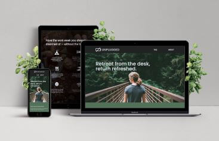

# Unplugged

- [Overview](#overview)
  - [Screenshot](#screenshot)
  - [Links](#links)
- [My process](#my-process)
  - [Built with](#built-with)
  - [What I learned](#what-i-learned)
  - [Continued development](#continued-development)
  - [Useful resources](#useful-resources)
- [Author](#author)
- [Acknowledgments](#acknowledgments)

## Overview
- Unplugged is a 3-page responsive website from a design comp that adapts to mobile, tablet, and desktop screens.

### Screenshot

### Links
- Solution URL:
 https://github.com/Dev-Wy/Unplugged/
- Live Site URL:
 https://dev-wy.github.io/Unplugged/

## My Process
### Built with
-  CSS
-  Flexbox
-  HTML5
-  Media Queries
-  Responsive Typography

### What I learned
- I learned how to code a website with mulitiple pages. I was glad to learn how to work with links to multiple pages.

### Continued development
- I would like to work on another multi-page website like this.

### Useful Resources: 
- I love W3C School's validation services. 
- https://validator.w3.org/   
- https://jigsaw.w3.org/css-validator/

## Author
- Jake Wyant
- Portfolio: https://dev-wy.github.io/Portfolio/
- LinkedIn: https://www.linkedin.com/in/jakewyantdeveloper/

## Acknowledgments
- W3C for their resources. 
- Special thanks to Skillcrush for giving me the foundation to build on.
